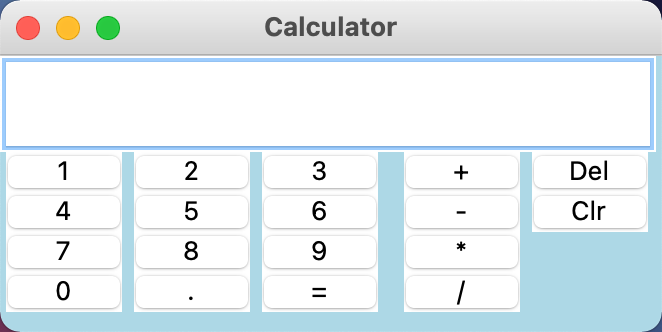

# Basic Calculator - MacOS

This is a basic calculator that I made in a little less than a day. I've been studying interested in Python ever since I learned it in college back in 2015. I've been stdying on and off for a few years now, and while I've learned a lot, but haven't posted anything on GitHub or anything. Thought I would start with some small projects and see how things go. Here's a screenshot of the calculator I made with tkinter.

When I moved the project over to my new MacBook, I realized the buttons looked a lot different and I couldn't see the text. So I made the buttons readable and actually made it possible for the calculator to accept typed input into the screen without raising an error.

Running the run_calc.py file runs the program.

Would love any feedback that you have.

Thanks!
